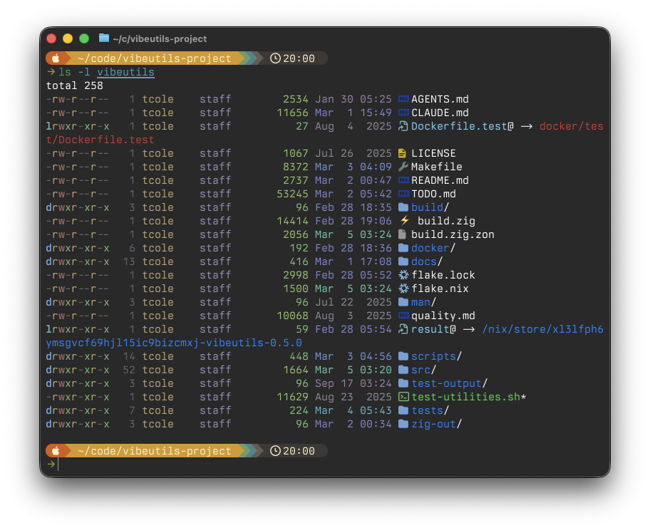
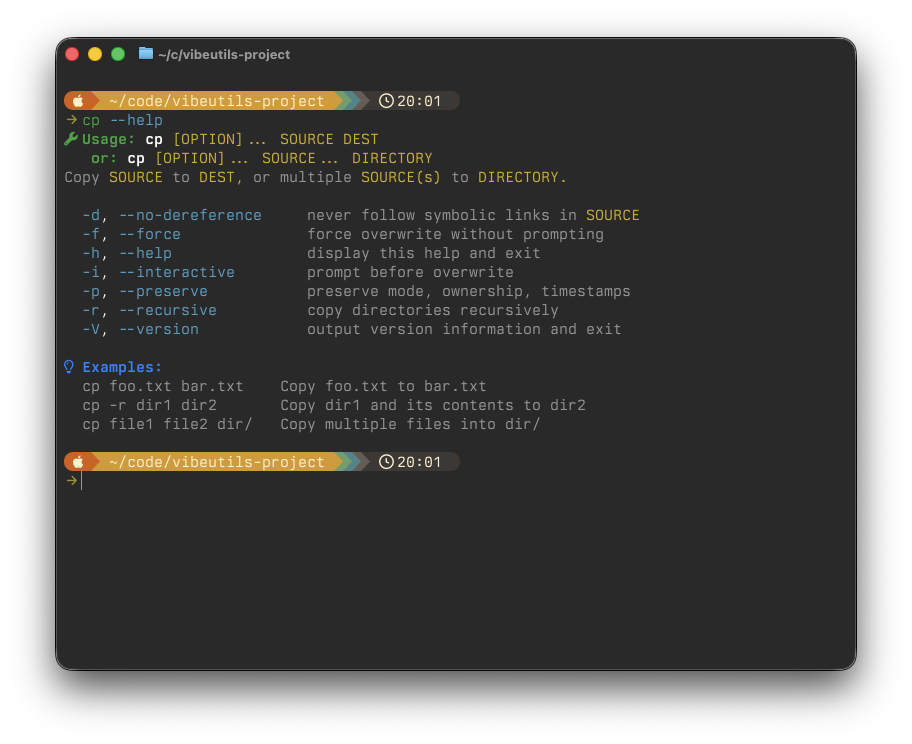

# vibeutils

Memory-safe Unix utilities written in Zig, inspired by GNU coreutils and OpenBSD.

**MIT Licensed** • **Linux** • **macOS** • **BSD**

## What's Different

vibeutils covers the 80% of GNU coreutils you actually use,
with modern terminal enhancements that activate
automatically.

**ls** gains the most:
- `--icons` — Nerd Font file type icons
- `--git` — inline git status per file
- `--time-style=relative` — "2 hours ago" instead of
  timestamps (default in long format)





**Across all utilities:**
- Colored `--help` with syntax-highlighted flags
- Smart terminal detection (NO_COLOR, 256-color, truecolor)
- Graceful degradation to plain text in pipes and dumb
  terminals

## Project Status

**Pre-1.0 (v0.8.0)**: 47 utilities with 100% POSIX flag
coverage (288 MUST + 220 SHOULD). Expect breaking changes
as we refine the design.

### Implemented Utilities

**File Operations**
`cat` `cp` `dd` `ln` `mkdir` `mktemp` `mv` `rm` `rmdir`
`touch`

**File Information**
`df` `du` `find` `ls` `readlink` `realpath` `stat`

**Text Processing**
`cut` `grep` `head` `nl` `sort` `tac` `tail` `tee` `tr`
`uniq` `wc`

**Path & Names**
`basename` `dirname` `pwd`

**User & Permissions**
`chmod` `chown` `id` `whoami`

**System & Process**
`date` `env` `free` `seq` `sleep` `timeout`

**Output & Control**
`echo` `false` `printf` `test` `true` `yes`

## Installation

### Homebrew (macOS/Linux)

```bash
brew install kelp/tap/vibeutils
```

Commands install with a `v` prefix (vls, vcp, vmv) to avoid
conflicts with system utilities. To use without prefix:

```bash
export PATH="$(brew --prefix)/opt/vibeutils/libexec/vibebin:$PATH"
```

### Nix

```bash
# Try it out
nix shell github:kelp/vibeutils

# Build locally
nix build github:kelp/vibeutils
```

Prebuilt binaries are available via Cachix. Without
this, Nix builds from source (requires Zig):

```bash
cachix use vibeutils
```

#### Persistent install (nix-darwin / home-manager)

Add the Cachix cache and vibeutils flake input, then
include the package in home-manager:

```nix
# flake.nix
inputs.vibeutils = {
  url = "github:kelp/vibeutils";
  inputs.nixpkgs.follows = "nixpkgs";
};
```

```nix
# home.nix
home.packages = [ inputs.vibeutils.packages.${pkgs.system}.default ];
```

With `cachix use vibeutils` configured, this pulls
prebuilt binaries instead of compiling.

Nix installs use original names (no prefix) since Nix
environments are isolated.

### Build from source

Requirements: Zig 0.15.2 or later

```bash
git clone https://github.com/kelp/vibeutils.git
cd vibeutils
zig build -Doptimize=ReleaseSafe
```

Find binaries in `zig-out/bin/`.

## Development

```bash
just build          # Build all utilities
just test           # Run unit tests
just it             # Run integration tests
just coverage       # Coverage report
just fmt            # Format code
just                # List all recipes

# Single utility
just build-util grep
just test-util grep
just run grep -- -r TODO src/
```

### Testing

- Unit tests embedded in each source file
- Integration tests in `tests/utilities/`
- Privileged tests via fakeroot
- Target: 90%+ coverage

## License

MIT License - see [LICENSE](LICENSE) file.
